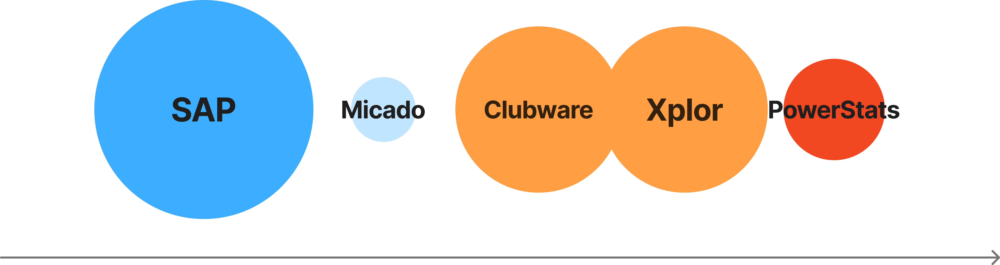
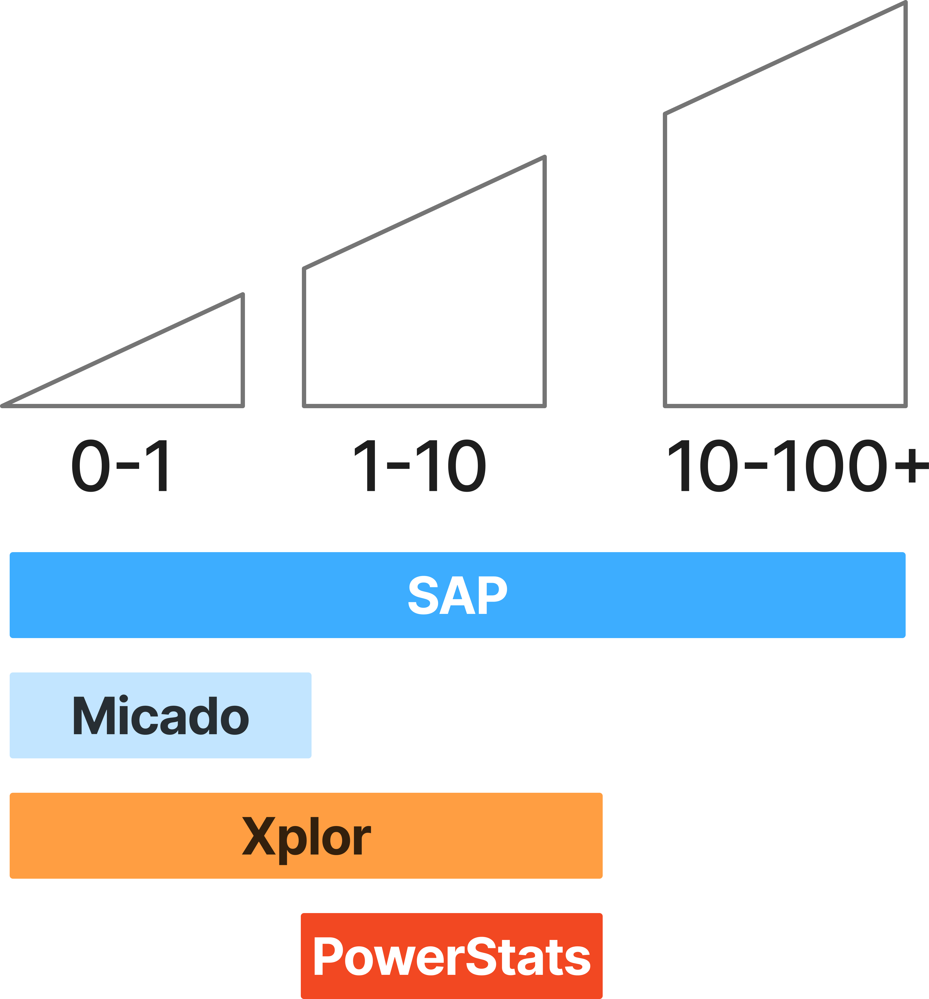
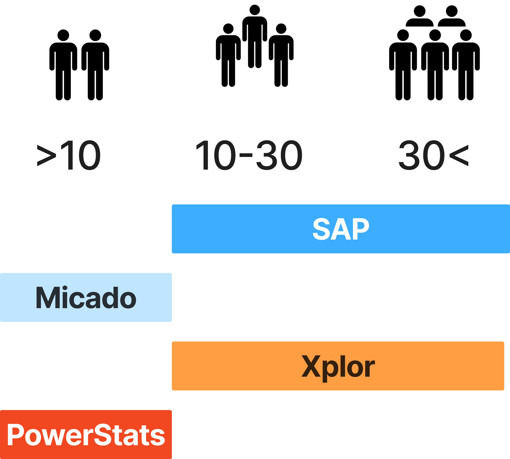

---
# Feel free to add content and custom Front Matter to this file.
# To modify the layout, see https://jekyllrb.com/docs/themes/#overriding-theme-defaults

layout: default
---

  

    

      

        <h1>Hi, I am <strong>Victor Wündisch</strong>! Nice to meet you.</h1>
      

      

        
I offer my experience in Product Leadership to tech companies in New Zealand

      

        <a href="https://calendly.com/vicwue/quickchat" class="button-cta">Book a chat on my calendar!</a>
        <a href="services" class="secondary-cta">Or check out my services here</a>
        
    

      

        
      

    
Mobile: (+64)2040285012 Email: <a href="mailto:vicwue@gmail.com">vicwue@gmail.com</a> LinkedIn: <a href="https://linkedin.com/in/vicwue">linkedin.com/in/vicwue</a>

<h2>About me:</h2>
An internationally experienced Product Manager and leader of creative professionals. With over a decade of experience and demonstrated success working in SaaS product roles with large companies including SAP, Xplor and small Kiwi start-ups Micado and PowerStats.

    

        

            Responsible for portfolios of products across the <b>entire product lifecycle</b>, from discovery, launch to sunset.
        

        

    

    

        

            Enjoying the impact of leveraging <b>cross-functional teams</b> to achieve greater business outcomes.
        

       
        
    

An academic background in Software Engineering and Business Administration, along with an early interest in fields such as User Experience and Design Thinking has enabled a professional development focus on customer-centricity and empathy working with users.

<h2>What I am known for:</h2>
* **Strategic Leadership** – fostering collaboration and building capacity across teams long term
* **Product Vision** – utilising a customer-centric approach and value proposition focus
* **Creative Collaboration** – Encouraging creative environments, nurturing ideas and innovation
* **Stakeholder Management & Communication** – internal and external, public speaking, lectures, webinars, websites, presentations to a range of audiences
* **International Experience** – working virtually and physically in large ‘blue-chip’ global organisations, diverse teams ranging from 2 to 200 & with a global customer base.
* **Technical Literacy** – keen interest and following trends in all things Cloud/Software/Technology
